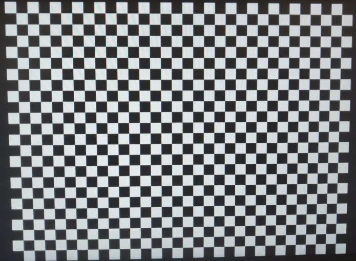
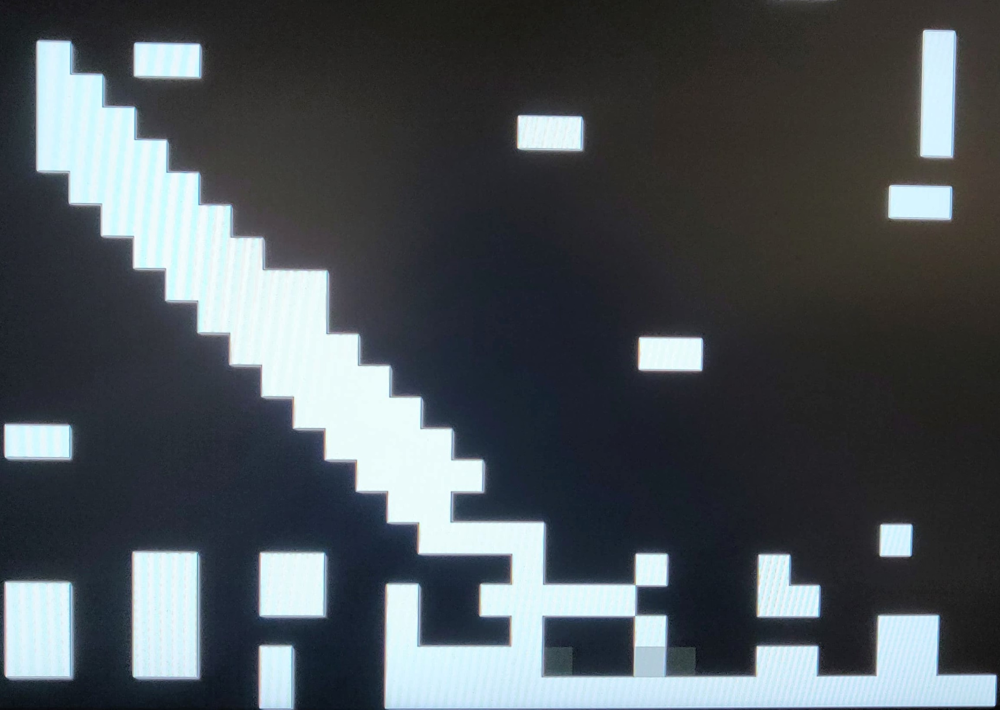

# 13.09.2020
Dodany gitignore, poprawiona struktura folderów i plików w repozytorium, dodane pierwsze pliki projektu w Quartus.

# 04.04.2020
Założenie repozytorium

# 02.09.2020
Zakończenie przerabiania książki "Systemy embedded w FPGA" autorstwa dr. Piotra Rzeszuta, będącej zbiorem podstawowej wiedzy potrzebnej do rozpoczęcia pracy w środowisku Quartus na płytce MAXimator.

# 28.10.2020
Zrobiony sterownik HDMI ze sprzętowym, testowym generatorem obrazu.

# 06.11.2020
Dołączony VRAM, działający connector RAM-u i sterownika HDMI, poprawione adresowanie pikseli w sterowniku.

# 10.11.2020
Podmiana statycznego obrazu z inicjalizacji pamięci VRAM, obrazem statycznym ustawionym z "kodu".

# 11.11.2020
Zaiplementowany licznik do likwidacji drgania styków i porty wejścia/ wyjścia na przyciski. W oprogramowaniu
dodana obsługa przerwań i wyświetlanie reagującego na nie kwadratu.

# 18.11.2020
Gotowy silnik gry (zoptymalizowany po przesadzeniu z zajmowaną przez oprogramowanie pamięcią o jakieś 14kB). 
W pełni funkcjonalny z obsługą przerwań i interfejsem typu process input, update, render. Na wideo latająca 
piłka, na razie bez ograniczeń, sterowana przez przyciski. Przycisk "L" kieruje piłkę w lewy górny róg, "R" 
w prawy dolny, a "RES" zatrzymuje.

# 20.11.2020
Implementacja renderowania obiektów przeniesiona do obiektu "Rectangle" należącego do silnika. Tym samym 
programista samej gry nie musi się zastanawiać jak wyrenderować swój obiekt. "Tosz to nie jego zmartwienie":wink:

Po drodze było dosyć ciekawie:

# 20.11.2020
Gotowe obiekty dla gracza, siatki i paletki. Do zrobienia jeszcze piłka.
Najbliższe plany:
* kolizje, poruszanie piłki, poruszanie AI
* zliczanie punktów
* gameplay, czyli przyspieszająca piłka i inne łakocie
* start gry "Press RES to start". Na razie sam press przez przycisk "RES".
* renderowanie tekstu 

# 22.11.2020
Zaiplementowany ruch piłki, paletki gracza, paletki "AI" (na podstawie wysokości piłki wysyłane są polecenia processInput tj. funkcji, która przy normalnym graczu jest używana do reakcji paletki na przerwania), kolizje piłki ze ścianami i paletkami (AABB), paletki ze ścianami(zwykłe blokowanie ruchu jeżeli paletka jest przy granicy).
Najbliższe plany:
* gameplay, czyli przyspieszająca piłka i inne łakocie
* zliczanie punktów i renderowanie jako tekst  
* start gry "Press RES to start"

# 24.11.2020
Szybka poprawa jakości kodu, niestety z naciskiem nie na wygląd i uniwersalność, ale na ilość zajmowanej pamięci. Na razie uzysk to około 312 bajtów. Nie jest to wiele ale przy obecnych planach i wyniku 3016 bajtów pozostałych na stack i heap to całkiem nieźle. 
Najbliższe plany:
* gameplay, czyli przyspieszająca piłka i inne łakocie
* zliczanie punktów i renderowanie jako tekst  
* start gry "Press RES to start"

# 24.11.2020
Implementacja wyświetlania znaków, która w grze została użyta do wyświetlenia wyników. Zaimplementowane również przyspieszanie piłki po kolizji z dowolnym obiektem. Resetowanie wyników po przekroczeniu 9 punktu oznacza wygraną zawodnika, którego punkty przekroczyły limit.

# 26.11.2020
Poprawiony gameplay przez zwiększenie prędkości startowej piłki i odpowiednie ograniczone zmniejszanie opóźnienia update-u. Podobnie paletka ma mniej ograniczoną częstotliwość updatu, dzięki czemu prędkość wzrosła ponad dwa razy. To jest prawdopodobnie koniec tej wersji projektu.

